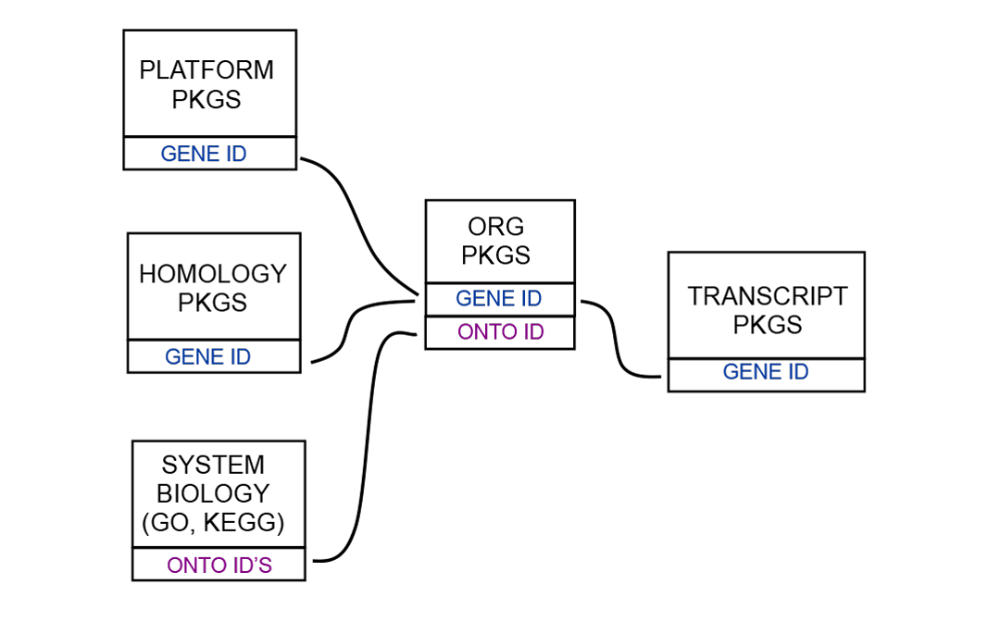

`r Biocpkg("OrganismDbi")` is a software package that helps tie together
different annotation resources. It is expected that users may have previously
made or seen packages like `r Biocpkg("org.Hs.eg.db")` and 
`r Biocpkg("TxDb.Hsapiens.UCSC.hg19.knownGene")`. Packages like these two are 
very different and contain very different kinds of information, but are still 
about the same organism: Homo sapiens. The `r Biocpkg("OrganismDbi")` package 
allows us to combine resources like these together into a single package 
resource, which can represent ALL of these resources at the same time. An 
example of this is the `r Biocpkg("Homo.sapiens")` package, which combines 
access to the two resources above along with others.

This is made possible because the packages that are represented by 
`r Biocpkg("Homo.sapiens")` are related to each other via foreign keys.

```{r figure, fig.cap = "Relationships between Annotation packages", echo = FALSE}

```

#   Getting started with OrganismDbi

Usage of a package like this has been deliberately kept very simple. The methods
supported are the same ones that work for all the packages based on
*AnnotationDb* objects. The methods that can be applied to these new packages
are `columns`, `keys`, `keytypes` and `select`. 

So to learn which kinds of data can be retrieved from a package like this we
would simply load the package and then call the `columns` method.

```{r columns, message = FALSE, warning = FALSE}
library(Homo.sapiens)
columns(Homo.sapiens)
```

To learn which of those kinds of data can be used as keys to extract data, we
use the `keytypes` method.

```{r keys1, message = FALSE, warning = FALSE}
keytypes(Homo.sapiens)
```

To extract specific keys, we need to use the `keys` method, and also provide it
a legitimate keytype:

```{r keys2, message = FALSE, warning = FALSE}
head(keys(Homo.sapiens, keytype = "ENTREZID"))
```

And to extract data, we can use the `select` method. The select method depends
on the values from the previous three methods to specify what it will extract.
Here is an example that will extract, UCSC transcript names, and gene symbols
using Entrez Gene IDs as keys.

```{r select, message = FALSE, warning = FALSE}
k <- head(keys(Homo.sapiens, keytype = "ENTREZID"), n = 3)
select(
  Homo.sapiens,
  keys = k,
  columns = c("TXNAME", "SYMBOL"),
  keytype = "ENTREZID"
)
```

In addition to `select`, some of the more popular range based methods have also
been updated to work with an *AnnotationDb* object. So for example you could
extract transcript information like this:

```{r transcripts, message = FALSE, warning = FALSE}
transcripts(Homo.sapiens, columns = c("TXNAME", "SYMBOL"))
```

And the *GRanges* object that would be returned would have the information that
you specified in the columns argument. You could also have used the `exons` or
`cds` methods in this way.

The `transcriptsBy`,`exonsBy` and `cdsBy` methods are also supported. For
example:

```{r transcriptsBy, message = FALSE, warning = FALSE}
transcriptsBy(Homo.sapiens,
              by = "gene",
              columns = c("TXNAME", "SYMBOL"))
```

#   Making your own OrganismDbi packages

So in the preceding section you can see that using an `r Biocpkg("OrganismDbi")`
package behaves very similarly to how you might use a `TxDb` or an `OrgDb`
package. The same methods are defined, and they behave similarly except that
they now have access to much more data than before. But before you make your own
`r Biocpkg("OrganismDbi")` package you need to understand that there are few
logical limitations for what can be included in this kind of package.

* The 1st limitation is that all the annotation resources in question must
have implemented the four methods described in the preceding section (`columns`,
`keys`, `keytypes` and `select`).

* The 2nd limitation is that you cannot have more than one example
of each field that can be retrieved from each type of package that is included.
So basically, all values returned by `columns` must be unique across ALL of the
supporting packages.

* The 3rd limitation is that you cannot have more than one example of
each object type represented. So you cannot have two org packages since that
would introduce two `OrgDb` objects.

* And the 4th limitation is that you cannot have cycles in the graph.
What this means is that there will be a graph that represents the relationships
between the different object types in your package, and this graph must not
present more than one pathway between any two nodes/objects. This limitation
means that you can choose one foreign key relationship to connect any two
packages in your graph.

With these limitations in mind, lets set up an example. Lets show how we could
make `r Biocpkg("Homo.sapiens")`, such that it allowed access to 
`r Biocpkg("org.Hs.eg.db")`,
`r Biocpkg("TxDb.Hsapiens.UCSC.hg19.knownGene")` and 
`r Biocpkg("GO.db")`.

The 1st thing that we need to do is set up a list that expresses the way that
these different packages relate to each other. To do this, we make a list that
contains short two element long character vectors. Each character vector
represents one relationship between a pair of packages. The names of the vectors
are the package names and the values are the foreign keys. Please note that the
foreign key values in these vectors are the same strings that are returned by
the `columns` method for the individual packages. Here is an example that shows
how `r Biocpkg("GO.db")`, `r Biocpkg("org.Hs.eg.db")` and 
`r Biocpkg("TxDb.Hsapiens.UCSC.hg19.knownGene")` all relate to each
other.

```{r setupColData, message = FALSE, warning = FALSE}
gd <- list(
  join1 = c(GO.db = "GOID", org.Hs.eg.db = "GO"),
  join2 = c(
    org.Hs.eg.db = "ENTREZID",
    TxDb.Hsapiens.UCSC.hg19.knownGene = "GENEID"
  )
)
```

So this `data.frame` indicates both which packages are connected to each other,
and also what these connections are using for foreign keys. Once this is
finished, we just have to call the `makeOrganismPackage` function
to finish the task.

```{r makeOrganismPackage, eval = FALSE}
destination <- tempfile()
dir.create(destination)
makeOrganismPackage(
  pkgname = "Homo.sapiens",
  graphData = gd,
  organism = "Homo sapiens",
  version = "1.0.0",
  maintainer = "Package Maintainer<maintainer@somewhere.org>",
  author = "Some Body",
  destDir = destination,
  license = "Artistic-2.0"
)
```

`makeOrganismPackage` will then generate a lightweight package
that you can install. This package will not contain all the data that it refers
to, but will instead depend on the packages that were referred to in the
`data.frame`. Because the end result will be a package that treats all the data
mapped together as a single source, the user is encouraged to take extra care to
ensure that the different packages used are from the same build etc.
